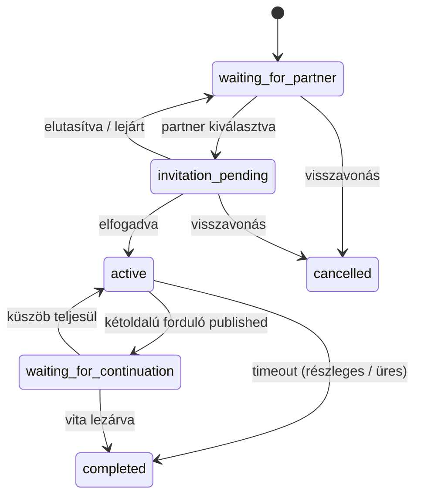

# Winunio — Állapotgépek (MVP)

Forrásigazság: [BUSINESS_RULES.md](BUSINESS_RULES.md), [DECISIONS.md](DECISIONS.md) (ADR-013–021).

Általános elv: egy eseményhez tartozó mellékhatások, ahol kritikus, **egyetlen adatbázis-tranzakcióban** futnak (különösen: folytatáskérés küszöb elérése, forduló megnyitás, `DebateReward` frissítés).

---

## Debate

**Kiinduló állapot:** `waiting_for_partner`

| Kiinduló állapot | Esemény | Következő állapot | Mellékhatás |
| ---------------- | ------- | ----------------- | ----------- |
| `waiting_for_partner` | Vitaindító kiválaszt egy jelentkezőt | `invitation_pending` | Meghívás létrejön; jelentkezés `invited` |
| `waiting_for_partner` | Vitaindító visszavonja a vitát | `cancelled` | Nyitott jelentkezések lezárulnak |
| `invitation_pending` | Kiválasztott jelentkező elfogadja | `active` | 1. forduló létrejön + megnyílik; többi jelentkezés lezárul; válaszidő indul |
| `invitation_pending` | Kiválasztott jelentkező elutasítja | `waiting_for_partner` | Meghívás `rejected`; jelentkezés lezárul; indító új partnert választhat |
| `invitation_pending` | Meghívás lejár (48 óra) | `waiting_for_partner` | Meghívás `expired`; indító új partnert választhat |
| `invitation_pending` | Vitaindító visszavonja a vitát | `cancelled` | Meghívás érvénytelen |
| `active` | Forduló lezárul — mindkét fél válaszolt | `waiting_for_continuation` | Forduló `published`; folytatáskérési időszak nyílik |
| `active` | Forduló timeout — csak egy fél válaszolt | `completed` | Részleges tartalom + semleges üzenet; **nincs** folytatáskérés |
| `active` | Forduló timeout — senki nem válaszolt | `completed` | Forduló tartalom nélkül zárul; **nincs** jutalom |
| `waiting_for_continuation` | Küszöb **nem** teljesül (admin / vita lezárás) | `completed` vagy marad | Elért jutalmi szint megmarad; új forduló nem nyílik |
| `waiting_for_continuation` | Küszöb teljesül (utolsó kérés atomikusan) | `active` | Következő forduló létrejön + megnyílik; `DebateReward` frissül; válaszidő indul |
| `active` | Moderáció / admin `under_review` | `under_review` | Írás és folytatáskérés felfüggesztése |
| `under_review` | Admin feloldja | előző állapot | — |
| `under_review` | Admin lezárja | `completed` | — |
| `*` | Admin / moderáció lezárja | `completed` | Jutalom nem számolódik újra |
| `*` | Vitaindító visszavonja (ha engedélyezett) | `cancelled` | — |

**Megjegyzés:** `active` ↔ `waiting_for_continuation` váltakozik minden sikeres, kétoldalú forduló + küszöb-elérés ciklusban, amíg a vita `completed` nem lesz.

---

## Round

**Kiinduló állapot:** `open` (létrehozáskor azonnal megnyílik)

| Kiinduló állapot | Esemény | Következő állapot | Mellékhatás |
| ---------------- | ------- | ----------------- | ----------- |
| `open` | Mindkét résztvevő beküldte a tartalmat | `published` | Tartalmak **egyszerre** publikálódnak |
| `open` | 72 óra lejárt — mindkét fél válaszolt | `published` | Ugyanaz, mint fent |
| `open` | 72 óra lejárt — csak egy fél válaszolt | `published` | Beküldött tartalom + semleges üzenet a másik oldalon; vita `completed` |
| `open` | 72 óra lejárt — senki nem válaszolt | `closed_without_content` | Nincs A/B kártya; vita `completed`; nincs jutalom |
| `published` | — (végállapot a fordulóra) | `published` | Folytatáskérés csak innen, ha vita `waiting_for_continuation` |

**Zárolt modell:** `open` alatt a beküldött tartalom nem nyilvános; résztvevők nem látják egymás aktuális válaszát.

**Timeout:** háttérfolyamat kezeli (nem oldalmegnyitás). 48h: emlékeztető; 72h: lezárás.

---

## DebateApplication

**Kiinduló állapot:** `pending`

| Kiinduló állapot | Esemény | Következő állapot | Mellékhatás |
| ---------------- | ------- | ----------------- | ----------- |
| `pending` | Felhasználó jelentkezik | `pending` | Rövid álláspont rögzítve |
| `pending` | Vitaindító kiválasztja | `invited` | Meghívás elküldve (48h lejárat) |
| `pending` | Jelentkező visszavonja | `withdrawn` | — |
| `pending` | Vita `cancelled` / másik partner elfogadva | `closed` | — |
| `invited` | Elfogadja a meghívást | `accepted` | Partner lesz; többi jelentkezés `closed` |
| `invited` | Elutasítja | `rejected` | Nem kerül vissza automatikusan; később újra jelentkezhet |
| `invited` | Lejár (48 óra) | `expired` | Ugyanúgy kezelve, mint `rejected` |
| `rejected` / `expired` | Új jelentkezés ugyanarra a vitára | `pending` | Új application rekord (nem automatikus visszaállítás) |

---

## ContinuationChallenge

**Kiinduló állapot:** `issued`

| Kiinduló állapot | Esemény | Következő állapot | Mellékhatás |
| ---------------- | ------- | ----------------- | ----------- |
| `issued` | WebAuthn + Turnstile sikeres; kérés rögzítve | `consumed` | `ContinuationRequest` létrejön; számláló nő |
| `issued` | WebAuthn / Turnstile sikertelen | `invalidated` | Nincs kérés; új challenge kell |
| `issued` | Lejárat (TTL) | `expired` | Nincs kérés; új challenge kell |
| `issued` | Küszöb elérése ugyanabban a tranzakcióban | `consumed` | + következő forduló + `DebateReward` |

**Szabály:** challenge egyszer használható — siker, hiba vagy lejárat után nem újrahasználható (ADR-019).

---

## ContinuationRequest

MVP-ben nincs külön `pending` / `confirmed` állapot.

| Esemény | Állapot | Mellékhatás |
| ------- | ------- | ----------- |
| Sikeres rögzítés (minden ellenőrzés OK) | `recorded` | Nyilvános számláló +1; `UNIQUE(user_id, completed_round_id)` |
| Ismételt próbálkozás (idempotens) | `recorded` | 200, meglévő rekord; számláló nem nő |
| Küszöb elérése (utolsó érvényes kérés) | `recorded` | Atomikusan: következő `Round` `open` + `DebateReward` + Debate `active` |

---

## DebateReward

**Kiinduló állapot:** nincs rekord (ADR-017)

| Esemény | Következő | Mellékhatás |
| ------- | --------- | ----------- |
| Első küszöb elérése | `simulated` rekord létrejön | UI: **első** jutalmi kártya megjelenik |
| További küszöb elérése | `simulated` rekord frissül | `amount_per_participant` = **teljes** új összeg |
| Vita `completed` | változatlan | Nem számolódik újra |
| Timeout félbemaradt forduló | változatlan | Korábbi szint megmarad; új szint nem |

**UI:** küszöb előtt **nincs** jutalom, sáv, „0 Ft”.

---

## Összefoglaló folyamat (happy path)

```text
Debate: waiting_for_partner
  → invitation_pending
  → active                    [1. forduló open]
  → waiting_for_continuation  [1. forduló published]
  → active                    [küszöb → 2. forduló open + DebateReward]
  → waiting_for_continuation  [2. forduló published]
  → …
```

---

## Atomikus tranzakció határa

**Egy tranzakció** (küszöböt elérő utolsó kérésnél):

1. `ContinuationRequest` INSERT (vagy idempotens NOOP ellenőrzés előtte)
2. érvényes kérések számolása
3. küszöb teljesülés ellenőrzése
4. `Round` INSERT + `open`
5. `DebateReward` INSERT/UPDATE
6. `Debate.status` → `active`
7. `ContinuationChallenge` → `consumed`
8. folytatáskérési időszak lezárása az előző fordulónál

**Korlátok:**

- `UNIQUE(user_id, completed_round_id)` — ContinuationRequest
- `UNIQUE(debate_id, unlocked_by_completed_round_id)` — DebateReward

---

## Mermaid — Debate állapotok



Kapcsolódó: [BUSINESS_RULES.md](BUSINESS_RULES.md), [DATA_MODEL.md](DATA_MODEL.md).
