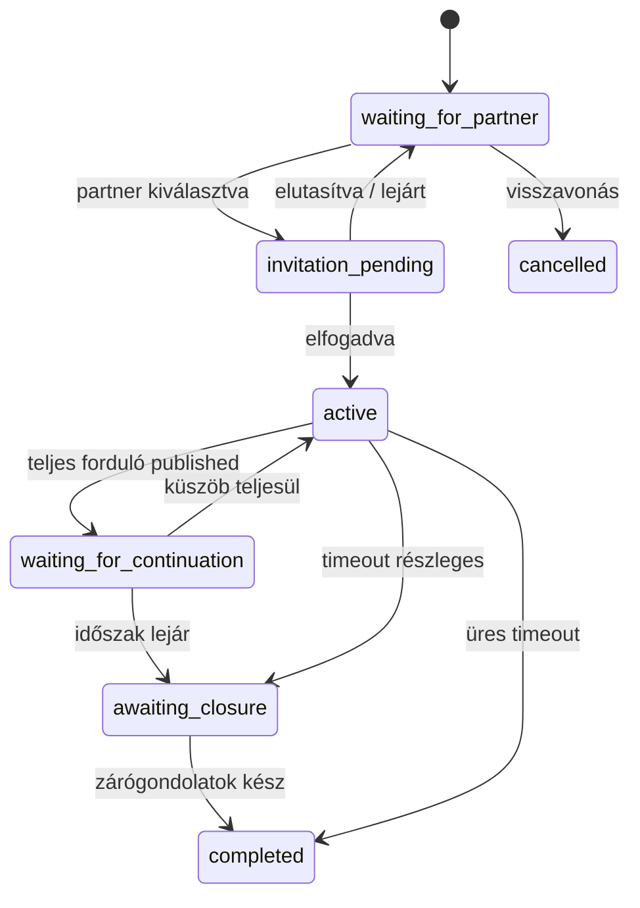

# Winunio — Állapotgépek (MVP)

Forrásigazság: [BUSINESS_RULES.md](BUSINESS_RULES.md), [DECISIONS.md](DECISIONS.md) (ADR-013–027).

Általános elv: egy eseményhez tartozó mellékhatások, ahol kritikus, **egyetlen adatbázis-tranzakcióban** futnak (különösen: folytatáskérés küszöb elérése, forduló megnyitás, `DebateReward` frissítés, zárógondolatok egyidejű publikálása).

---

## Debate

**Kiinduló állapot:** `waiting_for_partner`

| Kiinduló állapot | Esemény | Következő állapot | Mellékhatás |
| ---------------- | ------- | ----------------- | ----------- |
| `waiting_for_partner` | Vitaindító kiválaszt egy jelentkezőt | `invitation_pending` | Meghívás létrejön; jelentkezés `invited` |
| `waiting_for_partner` | Vitaindító visszavonja a vitát | `cancelled` | Nyitott jelentkezések lezárulnak |
| `invitation_pending` | Kiválasztott jelentkező elfogadja | `active` | 1. forduló létrejön + megnyílik; A válaszolhat; többi jelentkezés lezárul |
| `invitation_pending` | Kiválasztott jelentkező elutasítja | `waiting_for_partner` | Meghívás `rejected`; jelentkezés lezárul |
| `invitation_pending` | Meghívás lejár (48 óra) | `waiting_for_partner` | Meghívás `expired` |
| `invitation_pending` | Vitaindító visszavonja a vitát | `cancelled` | Meghívás érvénytelen |
| `active` | Teljes forduló lezárul (A + B megjelent) | `waiting_for_continuation` | Forduló `published`; folytatáskérési időszak |
| `active` | Forduló timeout — csak egy fél válaszolt | `awaiting_closure` vagy `completed` | Részleges tartalom + semleges üzenet; nincs folytatáskérés |
| `active` | Forduló timeout — senki nem válaszolt | `completed` | Forduló tartalom nélkül; nincs jutalom |
| `waiting_for_continuation` | Küszöb teljesül (utolsó kérés atomikusan) | `active` | Következő forduló `open`; `DebateReward` → `pending`; A válaszolhat |
| `waiting_for_continuation` | Folytatási időszak lejár küszöb nélkül | `awaiting_closure` | Függő jutalom megmarad; zárógondolatok szükségesek |
| `awaiting_closure` | Mindkét zárógondolat benyújtva | `completed` | Zárógondolatok **egyidejűleg** publikálódnak; jutalom kifizethetőség §9 |
| `awaiting_closure` | Egyik fél nem ír zárógondolatot (határidő / admin) | `completed` (befejezetlen) | Jutalom **nem** válik kifizethetővé |
| `active` | Moderáció / admin `under_review` | `under_review` | Írás és folytatáskérés felfüggesztése |
| `under_review` | Admin feloldja | előző állapot | — |
| `under_review` | Admin lezárja | `awaiting_closure` vagy `completed` | Kontextusfüggő |
| `*` | Admin / moderáció lezárja | `awaiting_closure` vagy `completed` | — |
| `*` | Vitaindító visszavonja (ha engedélyezett) | `cancelled` | — |

**Megjegyzés:** `active` ↔ `waiting_for_continuation` váltakozik minden sikeres, teljes forduló + küszöb-elérés ciklusban, amíg a vita `awaiting_closure` vagy `completed` nem lesz.

---

## Round

**Kiinduló állapot:** `open` (létrehozáskor azonnal megnyílik)

**Fordulón belüli fázisok** (`open` alatt, logikai — nem külön DB enum):

| Fázis | Nyilvános tartalom | Következő lépés |
|-------|-------------------|-----------------|
| `awaiting_a` | — | A beküld → A publikálódik |
| `awaiting_b` | A megszólalás | B beküld → B publikálódik → forduló `published` |

| Kiinduló állapot | Esemény | Következő állapot | Mellékhatás |
| ---------------- | ------- | ----------------- | ----------- |
| `open` | A beküldte a megszólalást | `open` | A tartalom **azonnal** publikálódik; fázis → `awaiting_b` |
| `open` | B beküldte a választ (A már publikálva) | `published` | B tartalom publikálódik; vita → `waiting_for_continuation` (ha teljes) |
| `open` | 72h lejárt — A + B megjelent | `published` | Ugyanaz, mint fent |
| `open` | 72h lejárt — csak A (vagy csak B) megjelent | `published` | Publikált tartalom + semleges üzenet; **nem** teljes forduló |
| `open` | 72h lejárt — senki nem válaszolt | `closed_without_content` | Nincs A/B kártya |
| `published` | — (végállapot a fordulóra) | `published` | Folytatáskérés csak teljes, kétoldalú esetben |

**Fontos:** A két hozzászólás **nem** egyszerre publikálódik. Az egyidejű közzététel **kizárólag** a zárógondolatoknál történik (lásd `ClosingStatement`).

**Timeout:** háttérfolyamat kezeli (nem oldalmegnyitás). 48h: emlékeztető; 72h: lezárás.

---

## ClosingStatement

**Kiinduló állapot:** nincs rekord (vita `awaiting_closure` alatt nyitható)

| Esemény | Állapot | Mellékhatás |
| ------- | ------- | ----------- |
| Egy fél benyújtja | `submitted` (láthatatlan a másiknak) | Partner még nem látja |
| Mindkét fél benyújtotta | `published` (mindkettő) | **Egyidejű** publikálás; vita → `completed`; jutalom kifizethetőség |

---

## DebateApplication

**Kiinduló állapot:** `pending`

| Kiinduló állapot | Esemény | Következő állapot | Mellékhatás |
| ---------------- | ------- | ----------------- | ----------- |
| `pending` | Felhasználó jelentkezik | `pending` | Rövid álláspont rögzítve |
| `pending` | Vitaindító kiválasztja | `invited` | Meghívás elküldve (48h lejárat) |
| `pending` | Jelentkező visszavonja | `withdrawn` | — |
| `pending` | Vita `cancelled` / másik partner elfogadva | `closed` | — |
| `invited` | Elfogadja a meghívást | `accepted` | Partner lesz; többi jelentkezés `closed` |
| `invited` | Elutasítja | `rejected` | Később újra jelentkezhet |
| `invited` | Lejár (48 óra) | `expired` | Ugyanúgy kezelve, mint `rejected` |
| `rejected` / `expired` | Új jelentkezés ugyanarra a vitára | `pending` | Új application rekord |

---

## ContinuationChallenge

**Kiinduló állapot:** `issued`

| Kiinduló állapot | Esemény | Következő állapot | Mellékhatás |
| ---------------- | ------- | ----------------- | ----------- |
| `issued` | WebAuthn sikeres; kérés rögzítve | `consumed` | `ContinuationRequest` létrejön; számláló nő |
| `issued` | WebAuthn sikertelen | `invalidated` | Nincs kérés; új challenge kell |
| `issued` | Lejárat (TTL) | `expired` | Nincs kérés; új challenge kell |
| `issued` | Küszöb elérése ugyanabban a tranzakcióban | `consumed` | + következő forduló + `DebateReward` `pending` |

**Szabály:** challenge egyszer használható — siker, hiba vagy lejárat után nem újrahasználható (ADR-019).

---

## ContinuationRequest

MVP-ben nincs külön `pending` / `confirmed` állapot.

| Esemény | Állapot | Mellékhatás |
| ------- | ------- | ----------- |
| Sikeres rögzítés (minden ellenőrzés OK) | `recorded` | Nyilvános számláló +1; `UNIQUE(user_id, completed_round_id)` |
| Ismételt próbálkozás (idempotens) | `recorded` | 200, meglévő rekord; számláló nem nő |
| Küszöb elérése (utolsó érvényes kérés) | `recorded` | Atomikusan: következő `Round` `open` + `DebateReward` `pending` + Debate `active` |

---

## DebateReward

**Kiinduló állapot:** nincs rekord (ADR-017)

| Esemény | Következő | Mellékhatás |
| ------- | --------- | ----------- |
| Első küszöb elérése | `pending` rekord létrejön | UI: **első** jutalmi kártya; összeg **függőben** |
| További küszöb elérése | `pending` rekord frissül | `amount_per_participant` = **teljes** új összeg |
| Vita `completed` + minden teljesítési feltétel | `simulated` | Kifizethető (MVP: szimulált megjelenítés) |
| Vita befejezetlen (hiányzó zárógondolat) | `pending` marad | Nem kifizethető |
| Timeout félbemaradt forduló | `pending` változatlan | Korábbi függő szint megmarad |

**UI:** küszöb előtt **nincs** jutalom, sáv, „0 Ft”.

---

## Összefoglaló folyamat (happy path)

```text
Debate: waiting_for_partner
  → invitation_pending
  → active                         [1. forduló open — A megszólal publikálódik]
  → active                         [B válasz publikálódik → forduló published]
  → waiting_for_continuation
  → active                         [küszöb → 2. forduló open + DebateReward pending]
  → …
  → awaiting_closure               [folytatási időszak vége vagy lezárás]
  → completed                      [két zárógondolat egyidejű publikálása]
```

---

## Atomikus tranzakció határa

**Egy tranzakció** (küszöböt elérő utolsó kérésnél):

1. `ContinuationRequest` INSERT (vagy idempotens NOOP ellenőrzés előtte)
2. érvényes kérések számolása
3. küszöb teljesülés ellenőrzése
4. `Round` INSERT + `open`
5. `DebateReward` INSERT/UPDATE → `pending`
6. `Debate.status` → `active`
7. `ContinuationChallenge` → `consumed`

**Egy tranzakció** (mindkét zárógondolat megérkezett):

1. mindkét `ClosingStatement` zárolása
2. `published_at` beállítása mindkettőn **egyidejűleg**
3. `Debate.status` → `completed`
4. `DebateReward.status` → `simulated` (ha minden feltétel teljesül)

**Korlátok:**

- `UNIQUE(user_id, completed_round_id)` — ContinuationRequest
- `UNIQUE(debate_id, unlocked_by_completed_round_id)` — DebateReward
- `UNIQUE(debate_id, participant_id)` — ClosingStatement

---

## Mermaid — Debate állapotok



Kapcsolódó: [BUSINESS_RULES.md](BUSINESS_RULES.md), [DATA_MODEL.md](DATA_MODEL.md).
