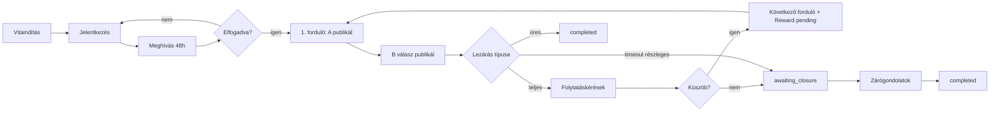

# Winunio — Felhasználói folyamatok

Minden folyamatnál figyelembe veendő dimenziók:

- normál út;
- üres állapot;
- hibaállapot;
- visszavonás;
- jogosultság;
- mobilnézet (reszponzív web).

---

## UF-01 — Vitaindítás

```
Bejelentkezés → Vita indítása
  → kérdés (max. 160 kar.)
  → kiinduló álláspont
  → kategória
  → névvel vagy anonimként (ellenőrzött fiók)
  → előnézet
  → közzététel
  → waiting_for_partner (várakozás jelentkezőkre)
```

| Dimenzió | Viselkedés |
|----------|------------|
| Üres | Nincs jelentkező — „Még nincs jelentkező” |
| Hiba | Validáció (160 kar., kötelező mezők) |
| Visszavonás | Vita `cancelled` (ha engedélyezett) |
| Jogosultság | Csak bejelentkezett felhasználó |
| Mobil | Ugyanaz a lépéssor, egyoszlopos |

---

## UF-02 — Jelentkezés

```
Vita megnyitása → Jelentkezem
  → rövid álláspont
  → jelentkezés megerősítése
  → várólista (pending)
```

| Dimenzió | Viselkedés |
|----------|------------|
| Üres | — |
| Hiba | Már jelentkezett / vita nem vár partnert |
| Visszavonás | `withdrawn` |
| Jogosultság | Bejelentkezett; nem lehet saját vitára jelentkezni |

---

## UF-03 — Partner kiválasztása és meghívás

```
Jelentkezők megtekintése (nincs rangsor)
  → partner kiválasztása
  → meghívás elküldése (48h)
  → invitation_pending
```

| Dimenzió | Viselkedés |
|----------|------------|
| Hiba | Nincs jelentkező |
| Lejárat | 48h után `expired` → waiting_for_partner |

---

## UF-04 — Meghívás elfogadása / elutasítása

```
Partner értesítés → Elfogadom / Elutasítom
```

| Eredmény | Következmény |
|----------|--------------|
| Elfogadás | UF-05 |
| Elutasítás | waiting_for_partner; indító újra választhat |
| Lejárat | Ugyanaz, mint elutasítás |

---

## UF-05 — 1. forduló automatikus indulás

```
Meghívás accepted
  → Debate active
  → Round #1 open (awaiting_a)
  → 72h határidő indul
  → NINCS folytatáskérés
```

**A** (vitaindító) adja az első megszólalást. **B** csak A publikált megszólalása után válaszolhat.

---

## UF-06 — Forduló: fokozatos publikálás

```
A → megszólalás beküldése
  → A tartalom AZONNAL nyilvános
  → „B válaszára várunk” (közönség)

B → A elolvasása → válasz beküldése
  → B tartalom nyilvános
  → forduló published (ha teljes)
  → folytatáskérés nyílik (ha teljes, kétoldalú)
```

| Lépés | UX |
|-------|-----|
| A publikálva, B hiányzik | A kártya látható + várakozás jelzés |
| B publikálva | Teljes forduló; folytatáskérés (ha §6 A) |

**Értesítés:** a néző kérhet értesítést B válaszára (UF-06a).

| Timeout ág | UX |
|------------|-----|
| A + B megjelent | Teljes forduló → folytatáskérés |
| Csak egy fél | Részleges + semleges üzenet → awaiting_closure vagy completed |
| Senki | „Érdemi tartalom nélkül lezárult” → completed |

---

## UF-06a — Értesítés B válaszára

```
Vita olvasása (A már publikálva, B még nem)
  → „Értesítést kérek B válaszáról”
  → [e-mail / push — implementációfüggő]
  → B válasza megjelenik
  → értesítés kiküldve
```

| Dimenzió | Viselkedés |
|----------|------------|
| Scope | Egy vitára / fordulóra kötött — **nem** követőrendszer |
| Jogosultság | Bejelentkezett vagy e-mail megadás (implementáció) |
| Hiba | Már kért / B már válaszolt |

---

## UF-07 — Folytatáskérés (közönség)

```
Vita olvasása (teljes published forduló után)
  → KÉREM A FOLYTATÁST
  → [első alkalom: telefon OTP]
  → Turnstile
  → challenge kiadás
  → Passkey (biztonságos azonosítás)
  → kérés rögzítve
  → számláló frissül
```

| Dimenzió | Viselkedés |
|----------|------------|
| Hiba | Már kért / nem teljes published / rate limit / Passkey fail |
| Idempotens | Ismételt kattintás → ugyanaz a rekord, számláló nem nő |
| Jogosultság | Bejelentkezett + verified e-mail + telefon (első) |

---

## UF-08 — Küszöb teljesülése

```
continuation_count >= küszöb
  → atomikusan: következő forduló open (awaiting_a) + DebateReward pending + active
```

UI: „Még X kérés szükséges” → 0-nál forduló megnyílik; jutalom **függőben** jelenik meg.

---

## UF-09 — DebateReward megjelenítés

| Állapot | UI |
|---------|-----|
| Küszöb előtt | Semmi |
| Küszöb után, vita folyamatban | Teljes összeg + **függőben** |
| Vita completed + zárógondolatok | Teljes összeg + tesztüzem (kifizethető / szimulált) |
| Befejezetlen vita | Függő összeg **nem** válik kifizethetővé |

---

## UF-10 — Vita lezárása (zárásra vár)

```
Folytatási időszak lejár küszöb nélkül
  VAGY timeout / moderáció miatti lezárás
  → awaiting_closure
  → mindkét vitázó: zárógondolat (rejtett egymás elől)
  → mindketten benyújtotta
  → zárógondolatok EGYSZERRE publikálódnak
  → completed
  → jutalom kifizethetőség ellenőrzése
```

| Dimenzió | Viselkedés |
|----------|------------|
| Hiányzó zárógondolat | Vita befejezetlen; jutalom nem kifizethető |
| Egyidejűség | **Csak** zárógondolatoknál |

---

## UF-11 — Be nem lépett látogató

- Vitát **olvashat** (nyilvános, már publikált tartalom — akár részleges forduló is).
- Folytatást **nem** kérhet — bejelentkezés szükséges.
- Értesítést kérhet B válaszára (UF-06a — implementációfüggő).
- Jelentkezni / vitát indítani nem tud.

---

## UF-12 — Jelentés / emberi moderáció

**Státusz:** Tervezett (API/UI)

```
Report → admin queue → under_review / action
```

Az AI tartalom-ellenőrzés **előtte** fut — lásd UF-13.

---

## UF-13 — Tartalom-ellenőrzés és közzététel

**Státusz:** Tervezett

```
Vitázó megírja szövegét (DebateEditor)
  → Beküldés ellenőrzésre / közzététel
  → Szerver: AI content review
  → approved → közzététel (A azonnal / B / zárógondolat szabály szerint)
  → revision_required → megjelölt részek + szabály; vitázó javít; újra
  → blocked → nincs közzététel; eset emberi queue (UF-12)
  → provider hiba → nincs közzététel; „próbáld később”
```

| Dimenzió | Viselkedés |
|----------|------------|
| AI kimenet | **Nincs** átfogalmazás — csak jelzés |
| Idézet | Külön mező; review idézet kontextussal |
| Hiba | Fail-closed — ellenőrizetlen tartalom nem jelenik meg |

---

## UF-14 — Helyesírás-ellenőrzés (opcionális)

**Státusz:** Tervezett

```
Vitázó → „Helyesírás ellenőrzése” (külön gomb)
  → Javaslatok listája (eredeti / javítás / hely)
  → Egyenként elfogad / összes elfogad
  → Elfogadás nélkül szöveg változatlan
```

| Dimenzió | Viselkedés |
|----------|------------|
| Automatikus indulás | **Tiltott** |
| Bizonytalan eset | Nincs javaslat |
| Visszaállítás | Elfogadás előtti verzió megőrizve (UF-15) |

---

## UF-15 — Piszkozat és beillesztésvédelem

**Státusz:** Tervezett

```
Gépelés a fő mezőben (beillesztés tiltva)
  → Automatikus piszkozat mentés
  → Idézet / Forrás mező: beillesztés engedélyezett
  → Beillesztés a fő mezőbe → üzenet, szöveg nem kerül be
  → Oldal elhagyása mentetlen változásnál → figyelmeztetés
```

| Mező | Beillesztés |
|------|-------------|
| Saját érvelés | **Tiltva** |
| Idézet | Engedélyezett |
| Forrás | Engedélyezett (link) |

Akadálymentesség: ugyanaz a tilalom minden eszközre — [CONTENT_EDITOR.md](CONTENT_EDITOR.md) §7.

---

## Diagram (magas szint)



Kapcsolódó: [BUSINESS_RULES.md](BUSINESS_RULES.md), [STATE_MACHINE.md](STATE_MACHINE.md), [API.md](API.md), [CONTENT_EDITOR.md](CONTENT_EDITOR.md).
