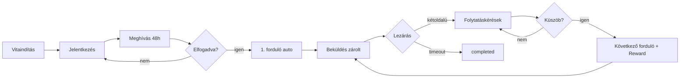

# Winunio — Felhasználói folyamatok

Minden folyamatnál figyelembe veendő dimenziók:

- normál út;
- üres állapot;
- hibaállapot;
- visszavonás;
- jogosultság;
- mobilnézet (reszponzív web).

---

## UF-01 — Vitaindítás

```
Bejelentkezés → Vita indítása
  → kérdés (max. 160 kar.)
  → kiinduló álláspont
  → kategória
  → névvel vagy anonimként (ellenőrzött fiók)
  → előnézet
  → közzététel
  → waiting_for_partner (várakozás jelentkezőkre)
```

| Dimenzió | Viselkedés |
|----------|------------|
| Üres | Nincs jelentkező — „Még nincs jelentkező” |
| Hiba | Validáció (160 kar., kötelező mezők) |
| Visszavonás | Vita `cancelled` (ha engedélyezett) |
| Jogosultság | Csak bejelentkezett felhasználó |
| Mobil | Ugyanaz a lépéssor, egyoszlopos |

---

## UF-02 — Jelentkezés

```
Vita megnyitása → Jelentkezem
  → rövid álláspont
  → jelentkezés megerősítése
  → várólista (pending)
```

| Dimenzió | Viselkedés |
|----------|------------|
| Üres | — |
| Hiba | Már jelentkezett / vita nem vár partnert |
| Visszavonás | `withdrawn` |
| Jogosultság | Bejelentkezett; nem lehet saját vitára jelentkezni |

---

## UF-03 — Partner kiválasztása és meghívás

```
Jelentkezők megtekintése (nincs rangsor)
  → partner kiválasztása
  → meghívás elküldése (48h)
  → invitation_pending
```

| Dimenzió | Viselkedés |
|----------|------------|
| Hiba | Nincs jelentkező |
| Lejárat | 48h után `expired` → waiting_for_partner |

---

## UF-04 — Meghívás elfogadása / elutasítása

```
Partner értesítés → Elfogadom / Elutasítom
```

| Eredmény | Következmény |
|----------|--------------|
| Elfogadás | UF-05 |
| Elutasítás | waiting_for_partner; indító újra választhat |
| Lejárat | Ugyanaz, mint elutasítás |

---

## UF-05 — 1. forduló automatikus indulás

```
Meghívás accepted
  → Debate active
  → Round #1 open
  → 72h határidő indul
  → NINCS folytatáskérés
```

Vitázók: zárolt beküldés, egymás válaszát nem látják `open` alatt.

---

## UF-06 — Forduló beküldés és publikálás

```
Vitázó → válasz beküldése (zárolt)
  → mindkét fél beküldött VAGY 72h lejárt
  → egyidejű publikálás
```

| Timeout ág | UX |
|------------|-----|
| Mindkét fél | published → folytatáskérés nyílik |
| Egy fél | Részleges + semleges üzenet → completed |
| Senki | „Érdemi tartalom nélkül lezárult” → completed |

---

## UF-07 — Folytatáskérés (közönség)

```
Vita olvasása (published forduló után)
  → KÉREM A FOLYTATÁST
  → [első alkalom: telefon OTP]
  → Turnstile
  → challenge kiadás
  → Passkey (biztonságos azonosítás)
  → kérés rögzítve
  → számláló frissül
```

| Dimenzió | Viselkedés |
|----------|------------|
| Hiba | Már kért / nem published / rate limit / Passkey fail |
| Idempotens | Ismételt kattintás → ugyanaz a rekord, számláló nem nő |
| Jogosultság | Bejelentkezett + verified e-mail + telefon (első) |

---

## UF-08 — Küszöb teljesülése

```
continuation_count >= küszöb
  → atomikusan: következő forduló open + DebateReward + active
```

UI: „Még X kérés szükséges” → 0-nál forduló megnyílik.

---

## UF-09 — DebateReward megjelenítés

| Állapot | UI |
|---------|-----|
| Küszöb előtt | Semmi |
| Első küszöb után | Teljes összeg mindkét vitázónál + tesztüzem felirat |

---

## UF-10 — Be nem lépett látogató

- Vitát **olvashat** (nyilvános published tartalom).
- Folytatást **nem** kérhet — bejelentkezés szükséges.
- Jelentkezni / vitát indítani nem tud.

---

## UF-11 — Jelentés / moderáció

```
Report → admin queue → under_review / action
```

---

## Diagram (magas szint)



Kapcsolódó: [BUSINESS_RULES.md](BUSINESS_RULES.md), [STATE_MACHINE.md](STATE_MACHINE.md), [API.md](API.md).
